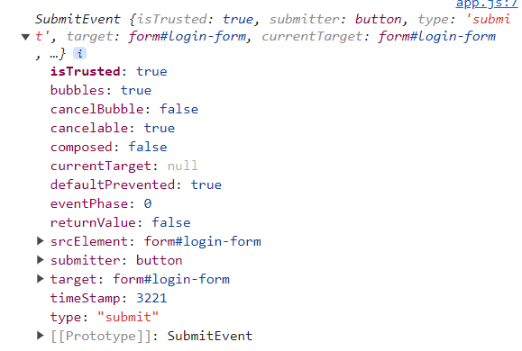

## LOGIN

1. 이름을 입력받기 위한 input 태그 작성

```html
<div id="login-form">
  <input type="text" placeholder="이름을 입력하세요" />
  <button>로그인</button>
</div>
```

2. 이름을 저장

- html 태그를 선택

- button에 이벤트 리스너 등록

- 입력창에 담긴 값 출력

> `input.value`는 input에 담긴 값을 가져온다.

```javascript
const loginInput = document.querySelector("#login-form input");
const loginButton = document.querySelector("#login-form button");

function onLoginBtnClick() {
  console.log(loginInput.value);
}

loginButton.addEventListener("click", onLoginBtnClick);
```

3. 유효성 검증

- 이름은 입력창에 입력하지 않았거나, 15자 보다 길지 않아야 한다.

- JS에서 string의 길이: `string.length`

```javascript
function onLoginBtnClick() {
  const username = loginInput.value;

  if (username === "") {
    alert("이름을 입력해주세요.");
  } else if (username.length >= 15) {
    alert("이름이 너무 깁니다.");
  }
}
```

- 이 유효성은 HTML의 `form`으로 설정할 수 있다.

> `required`: 필수 입력
> `maxlength`: 최대 글자

```html
<form id="login-form">
  <input required maxlength="15" type="text" placeholder="이름을 입력하세요" />
  <button>로그인</button>
</form>
```

4. form의 submit

   - 이벤트 리스너로 함수를 호출할 때, JS는 이벤트에 대한 정보(object)를 제공한다. 그 정보는 함수의 첫 번째 argument에 담겨있다.

> preventDefault(): 브라우저의 기본 동작을 막는 함수
> 여기서는 form의 submit에서 새로고침을 막는다.

```javascript
function onSubmit(e) {
  e.preventDefault();
  console.log(e);
}

loginForm.addEventListener("submit", onSubmit);
```



5. 이름 제출 후 폼 숨기기

5-1. HTML 요소를 숨기기

- 요소를 보이지 않게 하는 CSS class 생성

```css
.hidden {
  display: none;
}
```

- submit이 수행된 후 form에 class 추가

```js
function onSubmit(e) {
  e.preventDefault();
  const username = loginInput.value;
  loginForm.classList.add("hidden");
  console.log(username);
}
```

5-2. 유저 이름을 저장하면, 유저의 이름 나타나게 하기

- 유저 이름을 보여 줄 태그 작성

- form이 제출되기 전 까지 보이지 않는 상태

```html
<h1 id="greeting" class="hidden"></h1>
```

- form 제출 후 태그 활성화

> HIDDEN_CLASSNAME 변수
>
> 일반적으로 대문자로 표기된 변수는 string만 저장하고 싶을 때 사용한다. 중요한 정보(ex. loginForm, loginInput)를 담은것이 아니므로 대문자로 작성한다.

```js
const HIDDEN_CLASSNAME = "hidden";

function onSubmit(e) {
  e.preventDefault();
  const username = loginInput.value;
  loginForm.classList.add(HIDDEN_CLASSNAME);
  greeting.innerHTML = `Hello, ${username}!`;
  greeting.classList.remove(HIDDEN_CLASSNAME);
}
```

6. username 저장하기

- local storage를 사용해서 웹 브라우저에 저장한다.

  - 저장: `localStorage.setItem(key, value)`

  - 조회: `localStorage.getItem(key)`

  - 삭제: `localStorage.removeItem(key)`

- local storage에 저장된 유저 정보가 있으면, form 대신 h1 태그를 보여준다.

```js
const USERNAME_KEY = "username";

const savedUsername = localStorage.getItem(USERNAME_KEY);

if (savedUsername === null) {
  // show form
  loginForm.classList.remove(HIDDEN_CLASSNAME);
  loginForm.addEventListener("submit", onSubmit);
} else {
  // show greeting
  greeting.classList.remove(HIDDEN_CLASSNAME);
  greeting.innerHTML = `Hello, ${savedUsername}!`;
}
```

---

### 전체 로그인 코드

```js
const loginForm = document.querySelector("#login-form");
const loginInput = document.querySelector("#login-form input");
const loginButton = document.querySelector("#login-form button");
const greeting = document.querySelector("#greeting");

const HIDDEN_CLASSNAME = "hidden";
const USERNAME_KEY = "username";

function onSubmit(e) {
  e.preventDefault();
  const username = loginInput.value;
  loginForm.classList.add(HIDDEN_CLASSNAME);
  localStorage.setItem(USERNAME_KEY, username);
  paintGreeting(username);
}

function paintGreeting(username) {
  greeting.innerHTML = `Hello, ${username}!`;
  greeting.classList.remove(HIDDEN_CLASSNAME);
}

const savedUsername = localStorage.getItem(USERNAME_KEY);

if (savedUsername === null) {
  loginForm.classList.remove(HIDDEN_CLASSNAME);
  loginForm.addEventListener("submit", onSubmit);
} else {
  paintGreeting(savedUsername);
}
```
